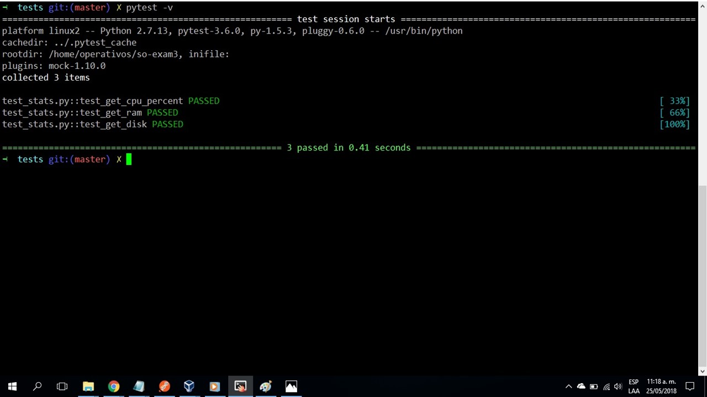

# so-exam3

# Tercer Parcial
 
**Nombre:** David Felipe Cobo Plazas

**Código:** A00309844

**URL repositorio:** https://github.com/davidcobogithub/so-exam3.git 

**Tabla de Contenido**

  - [1. Servicio web con Flask](#1-servicio-web-con-flask)
  - [2. Pruebas unitarias para el servicio web Flask](#2-pruebas-unitarias-para-el-servicio-web-flask)
  - [3. Integración continua para pruebas unitarias](#3-integración-continua-para-pruebas-unitarias)
  - [4. Referencias](#4-referencias)

# Solución Parcial 3

##  1. Servicio web con Flask

**1.** Se deben crear los archivos de texto llamados requirements.txt y requirements_dev.txt, que contienen las dependencias necesarias, para implementar el servicio web Flask.

**2.** Se crea un archivo llamado stats.py el cual contiene los métodos para traer la el consumo de CPU, la memorio disponible y el espacio de disco. La implementación es la siguiente:

```
#stats.py
import psutil

class Stats():
  @classmethod
  def get_cpu_percent(cls):
    cpu_percent = psutil.cpu_percent()
    return cpu_percent

  @classmethod
  def get_ram(cls):
    ram_available = psutil.virtual_memory()[2]
    return ram_available

  @classmethod
  def get_disk(cls):
    disk_available = 100-psutil.disk_usage('/')[3]
    return disk_available
```

**3.** Luego, se crea un archivo app.py el cual consume los servicios del servicio web flask, para obtener el consumo de cpu, la memorio disponible y el espacio de disco disponible. La implementación es la siguiente:

```
#app.py
from flask import Flask
import json
import sys
sys.path.append('/home/operativos/so-exam3')
from op_stats.stats import Stats

app = Flask(__name__)

@app.route("/cpu")
def CPU():
    return json.dumps({'Consumo de CPU: ':str(Stats.get_cpu_percent()*100)+"%"})

@app.route("/ram")
def RAM():
    return json.dumps({'MEMORIA RAM disponible: ':str(Stats.get_ram())+"%"})

@app.route("/disco")
def DISK():
    return json.dumps({'Disco Duro disponible: ':str(Stats.get_disk())+"%"})


if __name__ == "__main__":
    app.run(host='0.0.0.0',port=8080)
```

**4.** Ahora corremos el programa principal app.py con el comando ``` python app.py ```

**5.** Una vez se ejecuta sin ningún problema, usamos Postman para consumir los servicios expuestos. Para esto, escribimos la dirección ip junto con el puerto que se definió en el archivo y el nombre del servicio.

**6.** A continuación, se muestran las capturas de pantalla de la aplicación Postman de cada servicio:

Consumo de CPU:


MEMORIA RAM disponible:


Disco Duro disponible:


**7.** Se observan las peticiones en consola correctamente de la siguiente manera:


##  2. Pruebas unitarias para el servicio web Flask

**1.** Ahora haremos la implementación de pruebas unitarias. Para esto, creamos un archivo de nombre test_stats.py y se escribe la siguiente implementación de pruebas:

```
#test_stats.py
import pytest
from op_stats.app import app
from op_stats.stats import Stats

@pytest.fixture
def client():
  client = app.test_client()
  return client

def test_get_cpu_percent(mocker, client):
  mocker.patch.object(Stats, 'get_cpu_percent', return_value=1)
  response = client.get('/cpu')
  assert response.data.decode('utf-8') == '{"Consumo de CPU: ": "100%"}'
  assert response.status_code == 200

def test_get_ram(mocker, client):
  mocker.patch.object(Stats, 'get_ram', return_value=10)
  response = client.get('/ram')
  assert response.data.decode('utf-8') == '{"MEMORIA RAM disponible: ": "10%"}'
  assert response.status_code == 200

def test_get_disk(mocker, client):
  mocker.patch.object(Stats, 'get_disk', return_value=40)
  response = client.get('/disco')
  assert response.data.decode('utf-8') == '{"Disco Duro disponible: ": "40%"}'
  assert response.status_code == 200
```

**2.** Ejecutamos las pruebas usando el comando ``` pytest -v ```, el cual busca las pruebas disponibles dentro del directorio.

**3.** Si todo ha salido bien debe mostrar el resultado como el de la siguiente imagen:



##  3. Integración continua para pruebas unitarias

**1.** Para la integración continua creamos el archivo tox.ini en el cual se especifica, la librería de pruebas, el lenguaje base (python) y las dependencias que se van a usar. El comando para realizar esta configuración es:

```
vi tox.ini
```

**2.** Se agrega la siguiente configuración:

```
[tox]
envlist = pytest 

[testenv]
basepython = python3

[testenv:pytest]
deps =
  -rrequirements_dev.txt
commands =
  pytest
```

**3.** Para realizar los cambios de la configuración anterior y realizar la ejecución de las pruebas, se escribe el comando ``` tox -e pytest ```

**4.** Si todo ha salido bien, se debe mostrar el resultado como el de la siguiente imagen:


**5.** Ahora, para hacer la integración con Travis debemos crear el archivo .travis.yml, que es el archivo de configuración para Travis. Lo creamos con el comando ``` vi .travis.yml ```

**6.** Incluimos en el archivo la siguiente configuración:

```
sudo: false
language: python
notifications:
  email: false
python:
- '3.4'
install: pip install tox-travis
script: tox -e pytest
```

**7.** En la configuración anterior se encuentra que el lenguaje de trabajo es python3, realiza la instalación de tox-travis para correr las pruebas definidas anteriormente.

**8.** Para ver los resultados en la herramienta Travis debemmos hacer un pull request al repositorio https://github.com/ICESI-Training/so-exam3.git e inmediatamente se ejecutarán las pruebas.

**9.** Si todo ha salido bien, se debe mostrar el resultado como el de la siguiente imagen:


**10.** Adjunto los resultados de las pruebas obtenidos por Travis:


## 4. Referencias 

https://github.com/ICESI/so-microservices-python

https://github.com/ICESI/so-microservices-python/tree/master/01_virtualenvs

https://github.com/ICESI/so-microservices-python/tree/master/02_intro_flask

https://github.com/ICESI/so-microservices-python/tree/master/04_intro_testing
